# Mobile Web Specialist Certification Course (Nanodegree)

## Motivation

This project was built as a continuation of Mobile Web Specialist Nanodegree's Project stage 1 and 2 combined.
This repository consists of end to end functionalities of all the project stages.

The entire Nanodegree was carried out as a scholarship from **Google** and **Udacity** for the year 2018.

## Project Stage 3 - Features

### The entire project has been built using the following features:

* The application uses **Responsive Web Design** with **Flexbox** mostly, **CSS Grid** sparingly and **Media Queries** heavily.

* Responsive design is carried out keeping content in mind. Breakpoints are set according to content look as per screen starting from the smallest 300px device-width.

* **Accessibility** techniques such as use of **semantic HTML**, **roles**, **ARIA** attributes, **managing focus** have been carried out throughout the application along with **skip links** for both the pages as well. Care was taken to make sure most of the interactive elements used were native HTML elements.

* The 10 images in the first page are lazily loaded with the help of **Intersection Observer**.

* For performance optimization, the styles were loaded asynchronously with the help of **media** and **onload** attributes of link tag. This will prevent render blocking.

* **Service Worker** has been used extensively to cache different types of files such as **HTML**, **CSS**, **JavaScript**, **json**, **mapbox files**, **images** and places them accordingly into static or dynamic caches.

* For getting data related to restaurants and reviews through separate calls, for performance, if the user is online the data for both are fetched as **network then cache** strategy otherwise, the fallback strategy **cache then network** is used. This technique helps to revalidate the cache with latest content in the client's offline storage.

* **IndexedDB** is used with the help of Jake Archibald's **idb** library. Kudos to Jake!

* Review Form submission and Favourite a restaurant features are built with custom **Background sync**. Even if user enters data while offline, The data is stored into IndexedDB while offline and then it goes to server. Online and Offline events were tracked carefully!

* A generic Toast class was created from scratch alongwith css for informing users when they are online or offline. If user comes back online from offline state, the **background sync** for the specific tasks which user did are run and a toast message is shown in the app when the tasks finish syncing with the server.

* The **Gulp** build tasks have been written from scratch with custom requirements kept in mind. Delete old build from dist folder, Minification, bundling, support for latest ES6 syntax including import and export, css browser compatibility, WebP image generation from JPG images, gzipping, serving cached files with max-age set to 1 year via **gulp serve**, all have been carried out to bring out the most optimal performance of the application. Use **gulp build** to build the app.

## Setup & Run Guide

This application uses **Gulp** as its default task runner. Run the following commands in order to launch the application.

```
npm install
gulp build
gulp serve
```

The application will be running at http://localhost:9000/ . For screenshots of some of the applciation features, refer the section below.

## Lighthouse Audit Score

### Audit was carried out in Chrome's incognito mode under localhost without HTTPS configuration.
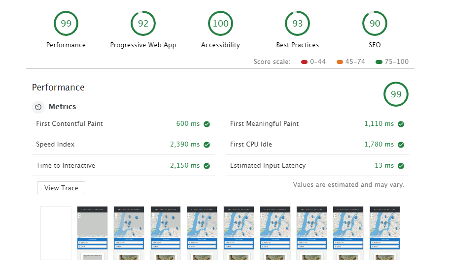

## Screenshots

The screenshots give a brief overview of the application features.

### iPhone 5SE View (Restaurants)
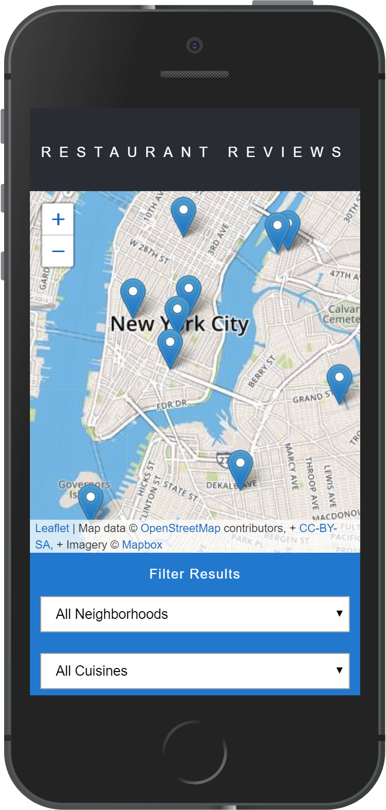

### iPad View (Restaurants)


### Desktop View (Restaurants)
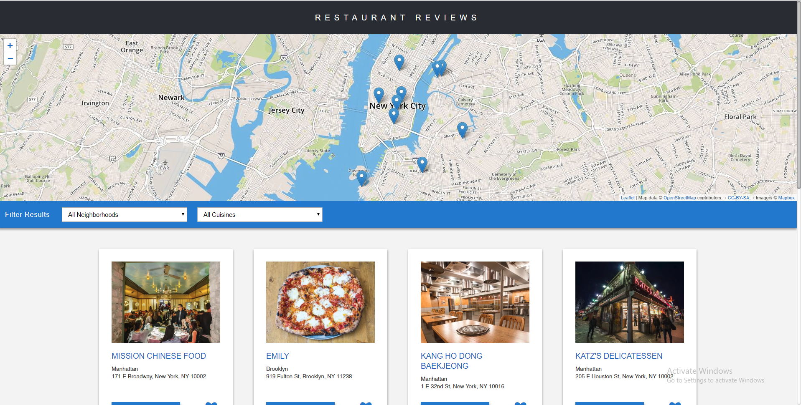

### iPhone 5SE View (Reviews)
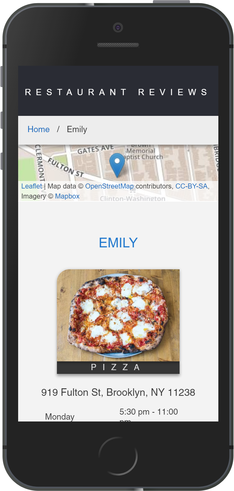

### iPad View (Reviews)
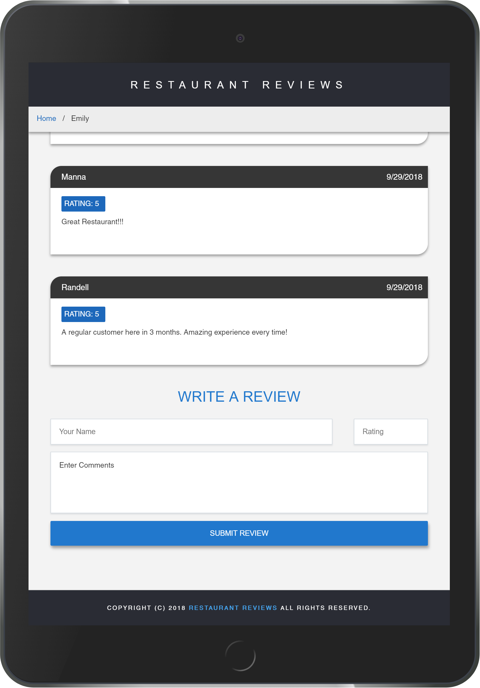

### Desktop View (Reviews)
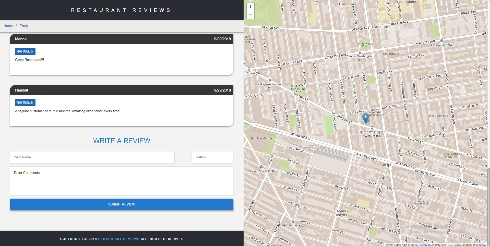

### Offline Restaurants & Favourite Feature With IndexedDB
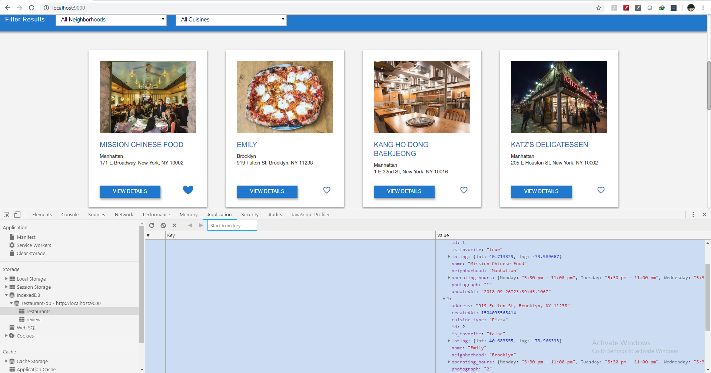

### Offline Reviews With IndexedDB
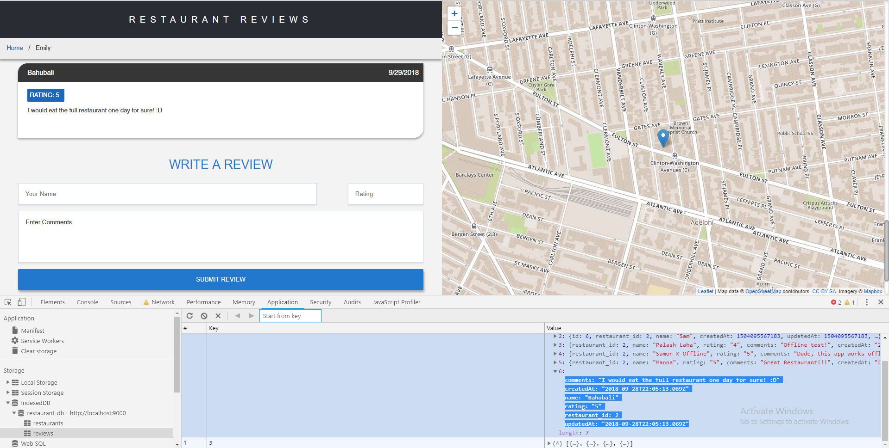

### Background Sync Favourite Toast
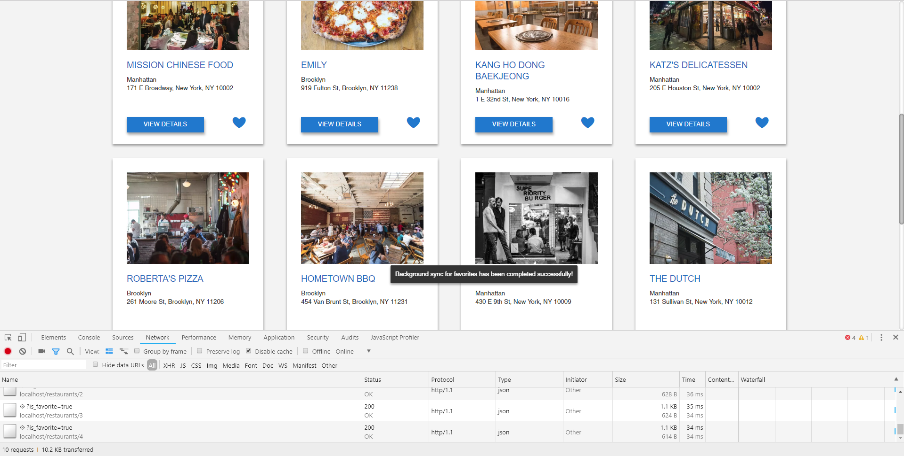

### Background Sync Reviews Toast
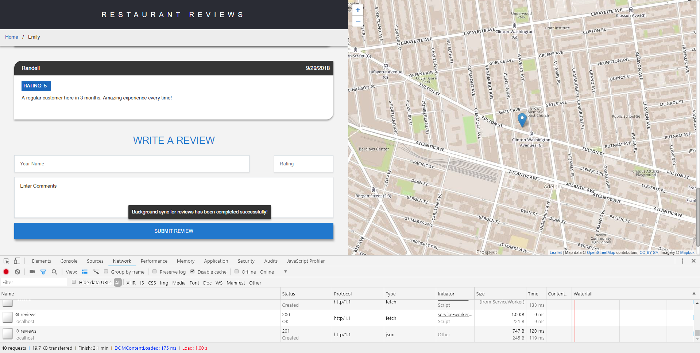

### Gulp Build
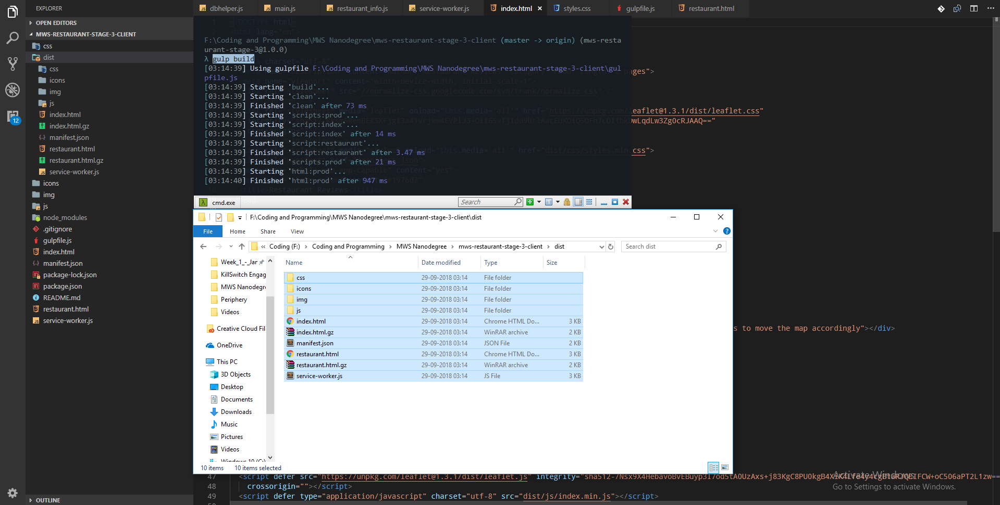
